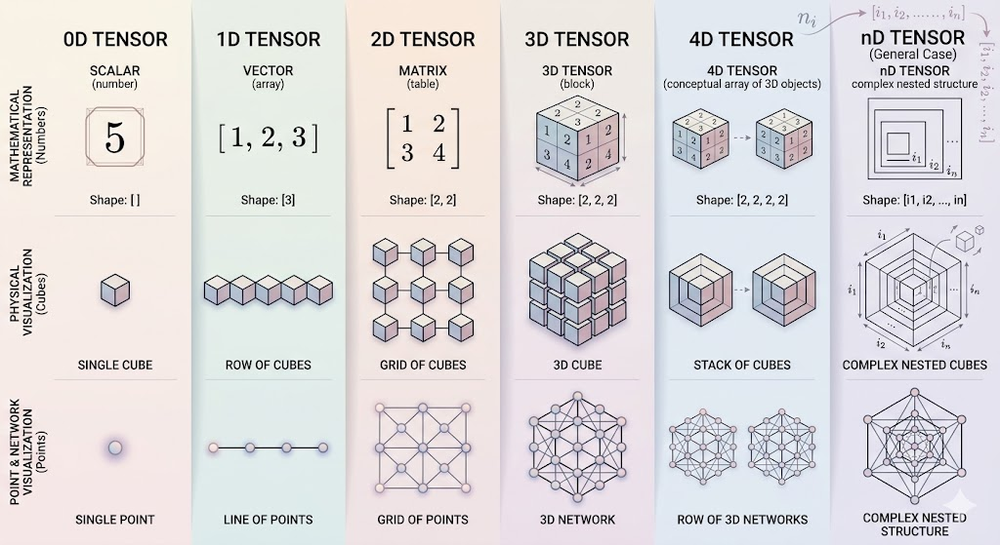
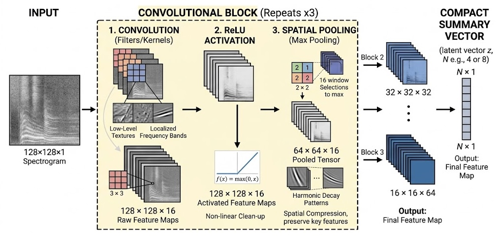

### Computational Architectures for Hybrid Feature Extraction
The previous chapter established the theoretical necessity of processing structural vibration data as two-dimensional spatial images. This chapter translates that mathematical theory into concrete computational models. We detail the step-by-step construction of the Convolutional Neural Network (CNN) backbone used to extract features from bridge vibrations. Furthermore, we define the exact configuration of the Variational Quantum Circuit (VQC) that serves as the classification head. Because this research bridges structural engineering and advanced computer science, we will first define the foundational computational concepts driving these architectures.

##### Foundational Data Structure: The Tensor
Civil engineers are deeply familiar with stress and strain tensors. 

In the context of machine learning, a "tensor" is simply a generalized mathematical term for a multi-dimensional array of numbers.
* A scalar (a single number) is a 0-dimensional tensor
* A vector (a list of numbers) is a 1-dimensional tensor
* A matrix (a grid of numbers, like a grayscale image) is a 2-dimensional tensor

We generate a 2D matrix when we convert a 10-second structural vibration into a Time-Frequency Spectrogram. However, computational frameworks like PyTorch process data in batches and color channels. So, our actual input into the neural network is a 4-dimensional tensor formatted as `(Batch Size, Channels, Height, Width)`. 
For our generated spectrograms:
* the channel depth is 1 (grayscale)
* the height corresponds to frequency bins
* the width corresponds to discrete time steps.

#### 2. The Classical Backbone: Convolutional Neural Network (CNN)
The objective of the classical CNN backbone is to take the high-dimensional spectrogram tensor and systematically compress it. It must distill thousands of pixels of noise and structural resonance into a compact, low-dimensional "summary" vector. This is achieved through a sequence of stacked convolutional blocks.

##### 2.1 Anatomy of a Convolutional Block
A standard convolutional block does not read the entire image at once. Instead, it processes the image using three sequential mathematical operations: 
1. convolution
2. non-linear activation
3. spatial pooling

**1. The Convolutional Layer (Filters/Kernels)**

Instead of looking at the global image, this layer uses small, learnable grids of numbers called "filters" or "kernels" (typically $3 \times 3$ pixels in size). The network slides this small filter across the entire spectrogram from left to right, top to bottom. At each step, it performs a mathematical dot product between the filter and the underlying pixels. If a filter has learned to recognize the visual pattern of a "frequency drop-off" caused by a structural crack, it will output a high numerical value whenever it slides over that specific pattern. This sliding process produces a new, filtered image called a "Feature Map". To rigorously test how spatial viewing windows affect damage detection, our experiments will evaluate both localized $3 \times 3$ filters and wider $5 \times 5$ filters.

**2. Non-Linear Activation (ReLU)**

Real-world structural behavior is highly non-linear. To allow the network to model these complex relationships, we pass the feature map through a Rectified Linear Unit (ReLU). This function is mathematically simple: it keeps all positive numbers exactly the same, but changes all negative numbers to zero:

$f(x) = \max(0, x)$. 

This operation aggressively removes irrelevant negative noise from the feature map.

**3. Spatial Pooling**

After filtering and activating the data, the image is still too large. We apply a  Pooling layer to reduce the spatial dimensions. Because this research aims to identify the optimal feature extraction strategy, we will benchmark two distinct pooling mechanisms. A Max Pooling layer selects the absolute highest pixel value within a small grid. This effectively isolates loud structural resonances. Conversely, an Average Pooling layer computes the mean of the grid, which may help the network retain subtle background environmental context. Both methods drastically shrink the width and height of the tensor while preserving the most prominent structural features.

##### 2.2 Classical Architecture Specification
Our classical backbone utilizes a tiered structure. As the tensor moves deeper into the network, its spatial dimensions (height and width) shrink due to pooling, while its depth (number of feature maps) increases. This forces the network to transition from learning basic edges to understanding complex global structural modes.

| Layer Type | Kernel Size | Stride | Output Channels (Depth) | Output Spatial Size | Function |
| :--- | :--- | :--- | :--- | :--- | :--- |
| Input Tensor | N/A | N/A | 1 | $128 \times 128$ | Raw grayscale spectrogram |
| Conv Block 1 | $3 \times 3$ or $5 \times 5$ | 1 | 16 | $64 \times 64$ | Extracts low-level textures |
| Conv Block 2 | $3 \times 3$ or $5 \times 5$ | 1 | 32 | $32 \times 32$ | Extracts localized frequency bands |
| Conv Block 3 | $3 \times 3$ or $5 \times 5$ | 1 | 64 | $16 \times 16$ | Detects harmonic decay patterns |
| Flatten Layer | N/A | N/A | 1 | $16384$ | Unrolls the 3D tensor into a 1D vector |
| Dense (Linear) | N/A | N/A | 1 | $N$ (e.g., 4,6 or 8) | Compresses to the final Latent Vector $z$ |

*(Note: The final output dimension $N$ dictates exactly how many qubits will be required in the subsequent quantum circuit)*

*This figure demonstrates a summary of anatomy of a convolutional block using max pooling* 

#### 3. The Quantum Classification Head (HQCNN)
In a purely classical model, the latent vector $z$ would be passed through several more dense layers to output a final prediction. We explicitly discard these final classical layers. 

To overcome the scarcity of damaged structural data, we feed the latent vector $z$ into a Variational Quantum Circuit (VQC).

##### 3.1 Hilbert Space
We must understand the concept of a Hilbert Space to understand why we'll use quantum mechanics. In classical computing, a 4-dimensional vector $z$ exists in a standard 4D geometric space. If the features representing "healthy" and "damaged" bridges overlap heavily in this space, drawing a clean mathematical line to separate them becomes nearly impossible.

A quantum system operates differently. A set of $N$ qubits exists in a complex geometric environment called a Hilbert Space, which contains $2^N$ dimensions. By encoding our classical 4D vector into 4 qubits, we mathematically project the data into a 16-dimensional space. Similarly, using 6 qubits would project out data into 64-dimensions; and using 8 qubits projects it into a massive 256-dimensional space. In this vastly expanded geometry, tightly tangled structural features spread out. This makes it significantly easier to draw a clean boundary between healthy and damaged classifications.

##### 3.2 The Variational Ansatz
The physical layout of the quantum circuit is referred to as the "Ansatz" (a German mathematical term meaning "initial guess" or "template"). Our Ansatz consists of three distinct functional stages.

**1. Angle Encoding**

We cannot feed standard classical numbers into a qubit. A qubit's state is defined by its position on a sphere (the **Bloch Sphere**). We use Angle Encoding to map our data. If the first number in our latent vector $z$ is $0.75$, we apply an $R_y$ rotation gate that physically rotates the first qubit by $0.75$ radians. This binds the structural feature directly to the quantum state.

**2. Strong Entanglement Layers**

Once the data is encoded, the circuit must look for correlations between the features. We achieve this using CNOT (Controlled-NOT) gates. Entanglement physically links the state of one qubit to another. If qubit A represents a drop in frequency and qubit B represents a shift in phase, entangling them allows the circuit to evaluate these two phenomena as a single, combined structural event.

To rigorously isolate the impact of quantum correlation on SHM diagnostics, our experiments will evaluate multiple entanglement topologies:

* **Unentangled:** CNOT gates are not applied. This acts as a scientific control to verify if expanding the data into superposition provides benefits even without feature correlation.

* **Ring (Circular):** Each qubit entangles strictly with its direct neighbor, forming a continuous closed loop. This provides efficient correlation with minimal computational overhead.

* **Full (All-to-All):** Every single qubit entangles with every other qubit. This maximizes mathematical correlation across all structural features, but pushes the limits of the optimizer by creating a highly dense parameter landscape.

**3. Parameterized Rotations**

Following entanglement, we apply another set of rotation gates. However, the angles for these rotations do not come from the structural data. These are the trainable weights ($\theta$) of the quantum network. During the training phase, the algorithm iteratively adjusts these rotation angles until the circuit learns to correctly identify bridge damage.

| Quantum Component | Operation / Gate | Mathematical Role |
| :--- | :--- | :--- |
| Qubits Required | $N$ Qubits ($N=4,6,8$) | Matches the dimension of the CNN latent vector $z$. Maps data into 16D, 64D or 256D spaces |
| Encoding Strategy | Angle Encoding ($R_y$ gates) | Embeds classical spatial features onto the Bloch sphere |
| Entanglement | Variable (Unentangled, Ring, Full) | Correlates distinct structural features across multiple sensor axes |
| Trainable Layers | Variable $L$ Repetitions (e.g., $L=2,4,6$) | Determines the depth and learning capacity of the quantum Ansatz. Benchmarked to prevent Barren Plateaus |
| Measurement | Pauli-Z Expectation ($\langle \hat{Z} \rangle$) | Collapses the quantum state into a classical probability of structural damage |