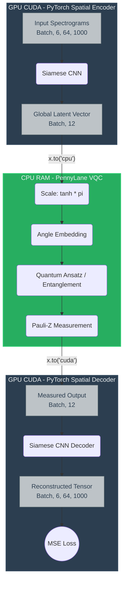

# The PyTorch-PennyLane Hardware Bridge and Gradient Flow

> *NOTE: This document explicitly details the Phase 4 spatial graph (12-qubit, 6-sensor) as it represents the maximum computational stress test of the hardware bridge. The Phase 3 single-sensor architecture is mathematically identical; it simply operates as a 2-qubit subset of this exact same pipeline.*

## Overview
Training a Hybrid Quantum-Classical Autoencoder (HQAE) requires merging two fundamentally different computational paradigms. 
* **PyTorch** operates on highly parallelized Graphical Processing Units (GPUs) using continuous automatic differentiation (`autograd`).
* **PennyLane** (`default.qubit`) simulates the complex probability amplitudes of a quantum state-vector, which is a highly memory-intensive process that natively executes on the Central Processing Unit (CPU).

This document outlines the exact engineering protocol, hardware handoffs, and mathematical gradient flow required to successfully bridge these two frameworks in Phase 4 of the SPECTRA-CQ architecture.

---

## 1. The Hardware Dilemma (CUDA vs. State-Vector Simulation)
In Phase 4, the Siamese Convolutional Encoder processes 6 high-resolution spectrograms simultaneously. This massive matrix multiplication requires GPU acceleration (CUDA). 

However, simulating a 12-qubit heavily entangled spatial graph directly on PyTorch CUDA tensors natively triggers catastrophic memory collisions and out-of-memory (OOM) faults. The state-vector simulator must calculate $2^{12} = 4,096$ complex amplitudes per batch item. 

To resolve this, our architecture implements a **Device Bridge** $\rightarrow$ an intentional, dynamic hardware handoff during every single forward and backward pass.

---

## 2. The Forward Pass (Data Translation)

The forward pass translates deterministic classical features into probabilistic quantum states.

**Step 2.1: The Classical Bottleneck (GPU)**
The Siamese encoder outputs a mathematically unconstrained tensor of shape `(Batch * 6, 2)`, representing 2 continuous features per sensor. This is reshaped into the global sensor graph tensor: `(Batch, 12)`.

**Step 2.2: Data Bounding & The CPU Handoff**
Classical unbounded floats will cause "phase wrapping" (over-rotation) on the Bloch sphere. Before the hardware handoff, the PyTorch graph applies a strict mathematical bound:
$$X_{scaled} = \tanh(X_{raw}) \times \pi$$
This bounds all features to the $[-\pi, \pi]$ domain. The bounded tensor is then detached from the GPU VRAM and pushed to the system RAM: `x.to('cpu')`.

**Step 2.3: The Quantum Execution (CPU)**
PennyLane's `qml.qnode` intercepts the CPU tensor.
* **Angle Embedding:** The 12 classical floats dictate the $R_x$ rotation angles for the 12 qubits, encoding the data into the quantum amplitudes.
* **Ansatz Execution:** The parameterized gates (e.g., `bridge_soft` topology) entangle the spatial nodes.
* **Measurement:** The circuit collapses by measuring the Pauli-Z expectation values $\langle \sigma_z \rangle$. This outputs a deterministic tensor of shape `(Batch, 12)` bounded between `[-1.0, 1.0]`.

**Step 2.4: The GPU Return**
The collapsed measurement tensor is pushed back into the GPU (`x.to('cuda')`), allowing the classical ConvTranspose decoder to reconstruct the spectrograms and compute the MSE loss.



*Figure 1: Hardware Handoff Flow Diagram $\uparrow$*

---

## 3. The Backward Pass (Gradient Flow)

This is the most mathematically complex stage. How does PyTorch's classical `autograd` engine backpropagate through a quantum simulator? 

PennyLane integrates with PyTorch by wrapping the quantum circuit in a `TorchLayer`. This layer registers as a custom autograd function. When PyTorch calls `.backward()` on the MSE loss, it hands control back to PennyLane to compute the quantum gradients.

### The Parameter-Shift Rule
Because quantum circuits are executed on physical hardware (or state-vector simulators), we cannot use classical backpropagation (chain rule through intermediate activations). Instead, PennyLane uses the analytical **Parameter-Shift Rule**.

To find the gradient of the loss function $L$ with respect to a specific quantum rotation angle $\theta$, the simulator executes the *entire quantum circuit twice* per parameter, shifting the angle forward and backward by a macroscopic amount $s$ (typically $s = \frac{\pi}{2}$):

$$\frac{\partial L}{\partial \theta} = \frac{L(\theta + s) - L(\theta - s)}{2 \sin(s)}$$

This provides the *exact* analytical gradient, not an approximation. 

```mermaid
graph LR
    classDef process fill:#3498db,stroke:#2980b9,color:white;
    classDef compute fill:#9b59b6,stroke:#8e44ad,color:white;
    
    A((Start Backward Pass)) --> B{Target Parameter: θ}
    B -- "Shift Forward: θ + π/2" --> C[Execute Quantum Circuit]:::process
    B -- "Shift Backward: θ - π/2" --> D[Execute Quantum Circuit]:::process
    
    C --> E[f(θ + π/2)]
    D --> F[f(θ - π/2)]
    
    E --> G["Gradient = [ f(θ + π/2) - f(θ - π/2) ] / 2"]:::compute
    F --> G
    
    G --> H((Pass to PyTorch Autograd))
```
*Figure 2: Parameter Shift Rule $\uparrow$*
> *Note (TO-DO): Create a visual diagram of the Parameter-Shift Rule. It should show a single rotation gate $\theta$, splitting into two parallel circuit executions ($\theta + \pi/2$ and $\theta - \pi/2$), and then converging into a gradient calculation.*

### The Classical-Quantum Gradient Disconnect
Once PennyLane computes the exact gradients for the 12-qubit circuit, it hands those gradients back to PyTorch's `autograd` to flow backward into the massive Convolutional Encoder.

#### **The Instability:**
* The quantum layer computes gradients analytically via macroscopic shifts
* The classical layer computes gradients via the microscopic chain rule

So, there is a severe scaling mismatch between them.
A small update in the quantum ansatz can trigger a cascading gradient explosion in the 6,400 classical features preceding it.

#### **The Solution:**
* We implement **Strict Gradient Norm Clipping** to prevent the classical spatial filters from shattering.
* PyTorch executes `torch.nn.utils.clip_grad_norm_` before the `Adam` optimizer steps $\implies$ this places a mathematical ceiling on the magnitude of the backward pass and ensures stable co-optimization of both domains.